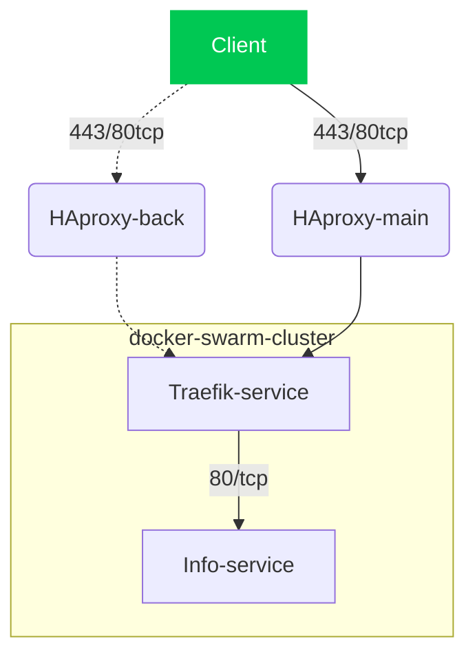

🛜
# Створення контейнерів з різними типами мережі #
# Контейнер з Bridge (мережа за замовчуванням)
```
docker run -d --name container_bridge nginx:latest
```
# Контейнер з Host мережею

```
docker run -d --network host --name container_host nginx:latest
```
# Контейнер з None мережею

```
docker run -d --network none --name container_none nginx:latest
```
# Контейнер з Macvlan
Gопереднь визначивши імя мережевого інтерфейсу за допомогою команд

```
ip ad 
```
або ж 
```
ifconfig
```

# Створюємо Macvlan мережу для статичного IP (налаштування під ваш інтерфейс, наприклад, eth0)
```
docker network create -d macvlan \
    --subnet=192.168.1.0/24 \
    --gateway=192.168.1.1 \
    -o parent=eth0 macvlan_static

docker run -d --network macvlan_static --ip 192.168.1.100 --name container_macvlan_static nginx:latest
```

# Контейнер з Macvlan мережею (DHCP)
```
docker network create -d macvlan \
    --subnet=192.168.2.0/24 \
    --gateway=192.168.2.1 \
    -o parent=eth0 macvlan_dhcp
```


Запуск контейнера, який має отримати IP через DHCP (в контейнері має бути DHCP-клієнт)
```
docker run -d --name macvlan_dhcp --network macvlan_dhcp --rm busybox udhcpc -i eth0
```


# Перевірити айпішок які присвоєні контейнерам можна за допомогою команд 
```
docker inspect container_name
docker inspect container_name | grep "IPAddress"
```
або ж 
```
docker exec container_name ifconfig 
docker exec container_name ip ad
```
що правда останні 2 варіанти на деяких "вендорах" не спрацьовує через відсутність ip-utils/ifconfig


💾
# Volume #
# Створення Docker Volume 
```
docker volume create shared_data
```

# Запуск двох контейнерів з підключенням спільного стореджу
```
docker run -d --name container_vol1 -v shared_data:/shared busybox tail -f /dev/null
docker run -d --name container_vol2 -v shared_data:/shared busybox tail -f /dev/null
```
# Створення файлу в одному з контейнерів (container_vol1)
```
docker exec container_vol1 sh -c "echo 'Привіт з container_vol1' > /shared/shared_file.txt"
```
# Демонстрація вмісту файлу у іншому контейнері (container_vol2)
```
docker exec container_vol2 cat /shared/shared_file.txt
```



